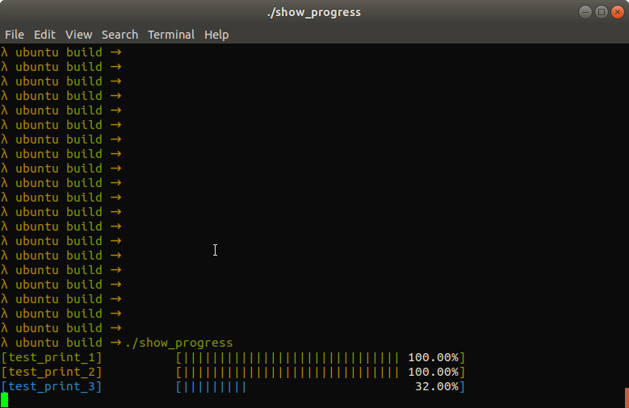

# show_progress
  A simple progress visualization tool.

## How to use
  ```
  git clone https://github.com/YJZLuckyBoy/show_progress.git
  mkdir build && cd build
  cmake ..
  make
  ./show_progress
  ```

<p align='center'>
    
</p>